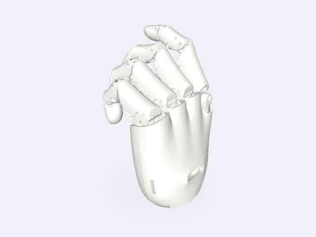
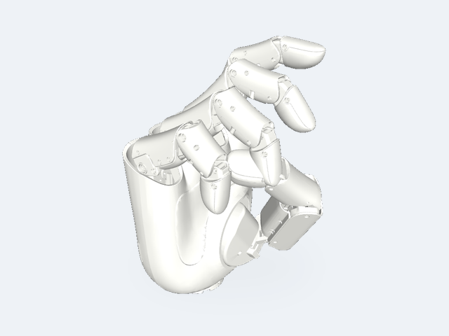

# GHand Assets

This repository contains public description assets for GHand dexterous hands. The package supports simulation, visualization, algorithm verification and robotics development.
The release provides URDF, MJCF and USD robot models, along with corresponding mesh geometric files.

## What Is Included

| System           | Description                                                          | Formats         |
|----|---|---|
| `ghand5_system`   | GHand 5 left and right dexterous hands                                 | URDF, MJCF, USD |
| `ghand_lite1_system`   | GHand Lite 1 left and right dexterous hands                                 | URDF, MJCF, USD |

## Visual Catalog

| Preview | Description files | Hand | Configuration | Side |
|---|---|---|---|---|
|  | URDF: ghand5_system/urdf/ghand5_left.urdf<br>MJCF: ghand5_system/mjcf/ghand5_left.mjcf<br>USD: ghand5_system/usd/ghand5_left.usd | GHand 5 | Single hand | Left |
|  | URDF: ghand5_system/urdf/ghand5_right.urdf<br>MJCF: ghand5_system/mjcf/ghand5_right.mjcf<br>USD: ghand5_system/usd/ghand5_right.usd | GHand 5 | Single hand | Right |


## Using the Models
URDF files can be loaded by common robotics tools such as ROS, RViz, Pinocchio, and other URDF-compatible parsers.
```
todo: add instructions
```

